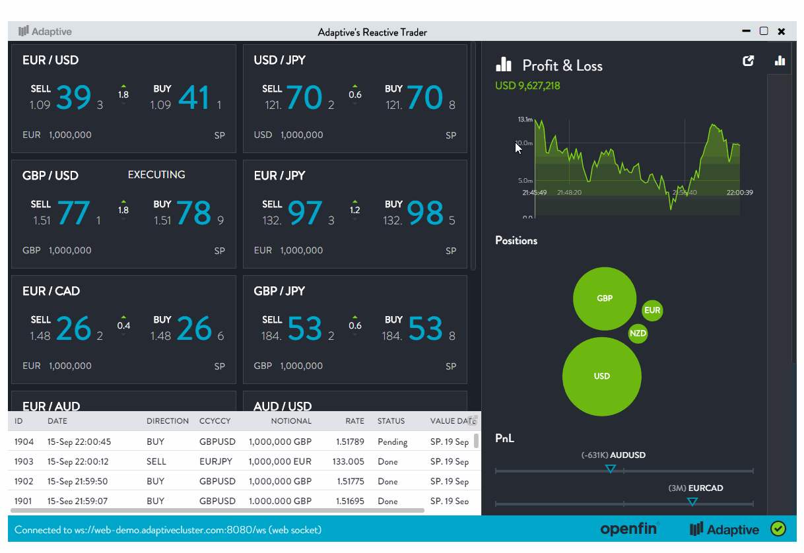

# Examples 

There is a range of examples showing how esp can be used.

The examples can be found in the [examples](https://github.com/esp/esp-js/tree/master/examples/) directory.

### API Examples
Several example bundled into a single script to demo various aspects of the API.

Checkout the [readme](https://github.com/esp/esp-js/tree/master/examples/api) with the example for more info.

### ESP Agile board

This [example](https://github.com/esp/esp-js/tree/master/examples/esp-js-react-agile-board) demonstrates a simple agile planning board.
It uses both [esp-js](https://www.npmjs.com/package/esp-js) and [esp-js-react](https://www.npmjs.com/package/esp-js-react) to build a unidirectional, model first application.

### Reactive Trader Cloud

[Reactive Trader Cloud](https://github.com/AdaptiveConsulting/ReactiveTraderCloud) is a more more elaborate and comprehensive reference implementation done by [Adaptive Financial](http://weareadaptive.com/). 
The GUI state is modeled using [esp-js](https://www.npmjs.com/package/esp-js) with dynamic view resolution done using [esp-js-react](https://www.npmjs.com/package/esp-js-react).

###  <a name="fbchat"> Facebook chat example using React and a reactive model with esp-js 

This example is written in ES6 using [babeljs.io](https://babeljs.io) and features the [reactive-model](../modelling-approaches/reactive-domain-model.md#reactive-model) approach.

Checkout the [readme](https://github.com/esp/esp-js/tree/master/examples/esp-chat-react-es6) with the example for more info.

### TodoMVC using React and esp-js

This example of the [MVC Todo app](http://todomvc.com) is written in ES5 and features the [event processor domain model](../modelling-approaches/event-processor-domain-model.md) approach.

Checkout the [readme](https://github.com/esp/esp-js/tree/master/examples/esp-todomvc-react) with the example for more info.