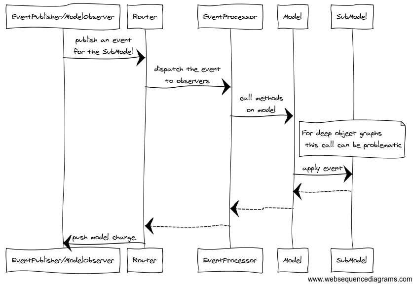

# Domain model

With the *Domain Model* approach, you structure you model like an aggregate root.
A single `EventProcessor` object observes all events from the router and calls various top level methods on your domain entity.
You top level domain entity handles updating all internal state, from the root of the object graph to the leaf nodes.
This includes interacting with [asynchronous](../advanced-concepts/asynchronous-operations.md) services to fetch or push data, model persistence, model validation etc.
Your domain entity exposes a read-only interface for model observers consumption.

This approach is useful for models that don't have very deep object graphs.
It can be come problematic when you have large object graphs that may need to react to common cross cutting events.