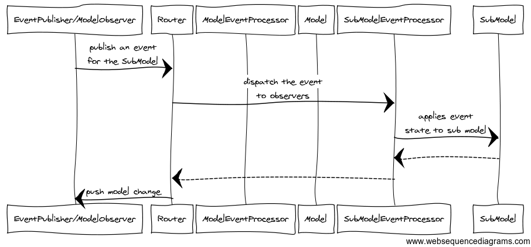

# Event Processor Domain Model

With the *Event Processor Domain Model* you have an event processor that's scoped to a particular node or branch of the model.
The event processor contains the logic on how to update that branch of the model.
This includes interacting with [asynchronous](../advanced-concepts/asynchronous-operations.md) services to fetch or push data, model persistence, model validation etc.
Your model is read/write allowing the event processor to make changes.
For many events, the parent object need not be concerned with changes happening to it's children (the parent may have it's own event processor managing it).

Below we see the moving parts.
Note the `Model` never receives the event for the `SubModel`.
While `Model` would hold reference to `SubModel`, updating `SubModel` is the responsibility of the `SubModelEventProcessor`.

This approach allows you to use the [event workflow](../advanced-concepts/complete-event-workflow.md) to propagate changes throughout you model.
For example, one event processor can receive an event, apply it to the model and call `Commit()` on the `EventsContext` received during event observation.
This allows other event processors, which are not responsible for the particular events state, to react.

The down side to this approach is your model is fully writable from anywhere.
You have to be very diligent so your event processors write only to the part they own.
The learning curve is also harder for new comers as the implicit relationships between the event processors and the model is non obvious.

> ##### Note
> This approach draws parallels with an [anemic domain model pattern](http://www.martinfowler.com/bliki/AnemicDomainModel.html).
> In essence you should never split your business logic for a single model entity into several unrelated types as it becomes hard to understand the implicit relations between these.
> If you do use this approach it's recommended to keep event processors inline with the model, i.e. if you have an `Order` entity, you'd have an `OrderEventProcessor`.
> If you end up with `UpdateOrderEventProcessor`, `ChangeQuantityEventProcessor` etc, you are truly on the way to an anemic modeling approach, it's not recommended.